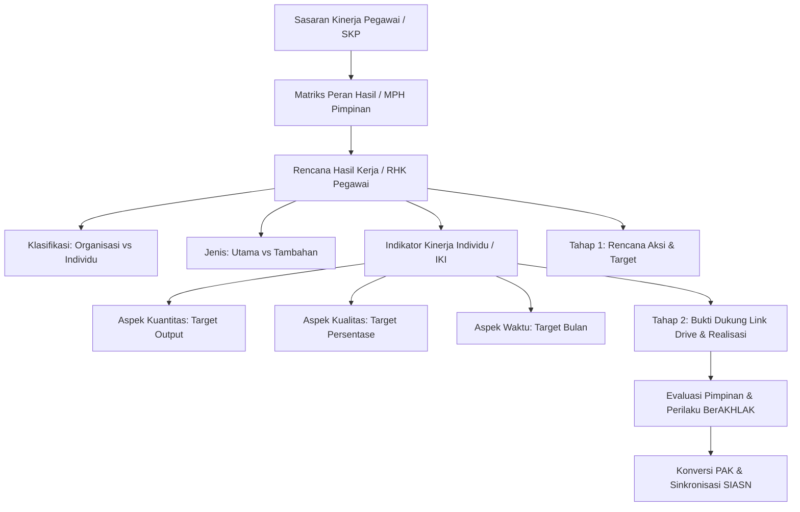

# BKN Nasional e-Kinerja & SIASN Integration Pipeline

```
Dasar Hukum   : PermenPANRB Nomor 6 Tahun 2022 & PermenPANRB Nomor 1 Tahun 2023
Target Portal : e-Kinerja BKN Nasional (https://kinerja.bkn.go.id) & SIASN / MyASN
Fokus Sistem  : Output & Outcome Makro (RHK, IKI, Rencana Aksi, Eviden Link Cloud)
Arsitektur    : One Logbook, Dual-Compliance (Sinergi Harian BKPSDM + Periodik BKN)
Integrasi     : Google Drive Auto-Vault, Gemini AI Formulator, Universal Chrome Bridge
```

---

## 🏛️ 1. Landasan Filosofis & Regulasi

Pengelolaan kinerja ASN nasional bertransformasi secara fundamental melalui **PermenPANRB Nomor 6 Tahun 2022** (Pengelolaan Kinerja Pegawai ASN) dan **PermenPANRB Nomor 1 Tahun 2023** (Jabatan Fungsional):
1. **Pergeseran dari Aktivitas ke Dampak:** Kinerja tidak lagi diukur semata-mata dari banyaknya jam kerja atau butir kegiatan harian, melainkan dari ketercapaian **Ekspektasi Pimpinan** dan kontribusi nyata pada **Sasaran Strategis Organisasi**.
2. **Cascading Berjenjang (Matriks Peran Hasil / MPH):** Kinerja pimpinan unit kerja (JPT) didistribusikan ke ketua tim kerja, lalu diintervensi langsung oleh pegawai pelaksana/fungsional (JF & JA).
3. **Konversi Angka Kredit Otomatis (PAK Integrasi):** Penilaian SKP periodik langsung menghasilkan predikat kinerja (Sangat Baik, Baik, Butuh Perbaikan, Kurang, Sangat Kurang) yang secara matematis dikonversikan menjadi **Angka Kredit Tahunan** dan dikirimkan langsung ke **SIASN (Sistem Informasi ASN BKN)** tanpa perlu pembuatan DUPAK konvensional.

---

## ⚖️ 2. Komparasi Arsitektur: e-Kinerja BKN Nasional vs e-Kinerja BKPSDM Solo

| Parameter | e-Kinerja BKPSDM Surakarta | e-Kinerja BKN Nasional (`kinerja.bkn.go.id`) |
| :--- | :--- | :--- |
| **Dasar Hukum** | Kepwal Surakarta No. 786/154/2020 | PermenPANRB No. 6/2022 & PermenPANRB No. 1/2023 |
| **Fokus Pengukuran** | **Input & Waktu Kerja (Effort):** Jam kerja efektif per hari | **Output & Hasil Kerja (Result):** Capaian target RHK |
| **Satuan Target** | Menit Kerja Efektif: **Minimal 8.400 Menit (140 Jam)/Bulan** | IKI: **Kuantitas (Output), Kualitas (%), Waktu (Bulan)** |
| **Frekuensi Laporan** | **Harian** (Setiap hari kerja) | **Periodik** (Triwulan I–IV dan Tahunan) |
| **Penyimpanan Eviden** | File fisik biner (PDF/JPG) diunggah ke server lokal | **Hyperlink Cloud Storage** (Google Drive / Dropbox) |
| **Alur Pengisian** | 1 Langkah: Input Form Harian (8 kolom) | **2 Tahap Bertingkat**: Rencana Aksi $\rightarrow$ Eviden Link & Realisasi |
| **Dampak Langsung** | **Pencairan TPP Bulanan Daerah** | **Evaluasi SKP & Kenaikan Pangkat Nasional (SIASN)** |

---

## 📑 3. Anatomi Struktur Data Dokumen e-Kinerja BKN



### A. Klasifikasi RHK:
- **RHK Organisasi:** Tertaut pada fungsi unit kerja/tim. Jika terjadi mutasi, promosi, atau pergantian pejabat, RHK ini tetap berjalan dan diwariskan ke pejabat penerus.
- **RHK Individu:** Tertaut secara personal pada keahlian/tugas spesifik pejabat yang bersangkutan.

### B. Tiga Aspek Wajib IKI:
1. **Kuantitas:** Jumlah dokumen, laporan, paket, atau layanan yang dihasilkan (contoh target: `1 Dokumen`, `1 Paket`, `2 Laporan`).
2. **Kualitas:** Persentase mutu, keakuratan, atau kesesuaian dengan standar regulasi (contoh target: `100 Persen`).
3. **Waktu:** Ketepatan rentang waktu penyelesaian kegiatan (contoh target: `12 Bulan` atau `3 Bulan`).

---

## 🔄 4. Prosedur Operasional Pengisian Dokumen Penilaian (Buku Panduan Bab 6)

### Tahap 1: Pengisian Rencana Aksi (Sub-bab 6.1.1)
- URL Akses: `https://kinerja.bkn.go.id/skp/.../penilaian/.../rencana_aksi`
- Untuk setiap RHK pada periode penilaian aktif, pegawai mengklik tombol hijau **`[Tambah]`** di kolom Rencana Aksi.
- Form meminta 2 parameter:
  1. `RENCANA AKSI`: Uraian taktis langkah terobosan / aksi nyata (contoh: *"Berita Acara KDP"*, *"Penyelenggaraan rekonsiliasi pengamanan aset"*).
  2. `TARGET`: Besaran kuantitatif aksi (contoh: *"1 Laporan"*, *"1 Dokumen"*).
- *Aturan Sistem BKN:* Rencana Aksi wajib diisi terlebih dahulu sebelum sistem mengizinkan input eviden hasil kerja.

### Tahap 2: Pengisian Bukti Dukung (Eviden) & Realisasi (Sub-bab 6.1.2)
- Halaman: Tab Pelaksanaan Penilaian (Tabel Hasil Kerja).
- **1. Kolom Bukti Dukung (Tombol `[Tambah]`):**
  - `Nama Eviden`: Judul berkas pembuktian (contoh: *"Berita Acara KDP"*).
  - `Bukti Eviden (Link ke file Google Drive/Dropbox/etc)`: URL tautan cloud storage yang dapat dibuka oleh pimpinan penilai.
- **2. Kolom Realisasi (Tombol `[Edit]`):**
  - `Realisasi`: Narasi capaian riil (contoh: *"1 Laporan berdasarkan Bukti Dukung Berita Acara KDP"*).
  - `Sumber Data`: Asal data pembuktian (contoh: *"Aplikasi E-Office RUANG SIGAP / SIMDA BMD"*).

### Tahap 3: Umpan Balik, Penilaian Perilaku, & Cetak (Sub-bab 6.1.3 – 6.1.8)
- Pimpinan memberikan rating Hasil Kerja & rating Perilaku Kerja 7 Core Values **BerAKHLAK** (Berorientasi Pelayanan, Akuntabel, Kompeten, Harmonis, Loyal, Adaptif, Kolaboratif).
- Fitur umpan balik rekan kerja 360 derajat (Sub-bab 6.1.5).
- Cetak Form Evaluasi dengan kolom **Anchor Tag** untuk tanda tangan digital tersertifikasi (BSrE).

### Tahap 4: Konversi Angka Kredit ke SIASN (Bab 8)
- Sistem e-Kinerja BKN menghitung konversi predikat tahunan:
  - **Sangat Baik:** $150\%$ koefisien angka kredit.
  - **Baik:** $100\%$ koefisien angka kredit.
  - **Butuh Perbaikan:** $75\%$, **Kurang:** $50\%$, **Sangat Kurang:** $25\%$.
- Pejabat penilai menyetujui draft PAK $\rightarrow$ Tombol **`[Sinkron AK SIASN]`** menembakkan data langsung ke profil MyASN pegawai untuk proses kenaikan pangkat otomatis.

---

## 🚀 5. Arsitektur Pemaksimalan di RUANG SIGAP & POROS (Zero Double-Entry)

Untuk membebaskan ASN dari beban kerja ganda, RUANG SIGAP mengadopsi model **"One Logbook, Dual-Compliance"**:

```
                       [Pengguna / ASN]
                              │
            ┌─────────────────┴─────────────────┐
            │   Mencatat Pekerjaan di SIGAP     │
            │   (Surat / Tugas / Logbook Harian)│
            └─────────────────┬─────────────────┘
                              │
          Tandai RHK: "rhkId: RHK-01 (Pengamanan BMD)"
                              │
            ┌─────────────────┴─────────────────┐
            │                                   │
   [Automasi Harian BKPSDM]            [Automasi Periodik BKN]
            │                                   │
  • Akumulasi Menit Kerja             • Grouping Dokumen per RHK
  • Auto-Select 152 Aktivitas         • Auto-Create Google Drive Folder
  • Sentinel Sore 16:30               • Gemini AI Formulator Rencana Aksi
  • 1-Klik Bridge BKPSDM              • Ekstensi Chrome Bridge BKN
            │                                   │
            ▼                                   ▼
    [Pencairan TPP Solo]               [SKP & Pangkat SIASN]
```

### 1. Tagging RHK pada Schema Logbook & Tugas
Setiap entri logbook atau tugas dinas di SIGAP dapat ditautkan ke RHK tahunan pegawai:
```typescript
export interface LogbookKegiatan {
  // ... field logbook harian
  rhkId?: string;           // ID RHK BKN (contoh: "rhk-bkn-01")
  rhkNama?: string;         // Judul RHK (contoh: "Tersedianya dokumen pengamanan BMD SKPD")
  rhkAspek?: 'Kuantitas' | 'Kualitas' | 'Waktu';
}
```

### 2. Auto-Clustering Google Drive Evidence Vault
Mengintegrasikan `sigap-google-drive-integration` untuk otomatis mengorganisasi berkas bukti:
- Struktur Folder: `SIGAP_E-KINERJA / [TAHUN] / [TRIWULAN] / [NAMA_RHK] /`
- Seluruh surat keluar, lembar disposisi yang telah tervalidasi, laporan tindak lanjut PDF, dan dokumentasi foto otomatis disalin ke folder terkait.
- Folder di-set permission *Anyone with link can view* (atau terbatas domain instansi).
- SIGAP langsung menyajikan link folder / file Drive siap injeksi ke BKN.

### 3. Gemini AI Formulator (Rencana Aksi & Realisasi)
Menggunakan prompt khusus untuk mensintesis ratusan entri aktivitas triwulanan menjadi formulasi standar BKN:
- **Input:** Kumpulan logbook dan tugas selesai dalam 1 triwulan untuk RHK tertentu.
- **Output AI:**
  - *Rencana Aksi:* Rumusan kalimat taktis baku birokrasi.
  - *Target:* Volume capaian riil (contoh: `1 Laporan`).
  - *Narasi Realisasi:* Formula standar: `"[X] [Satuan] telah diselesaikan sesuai target dan diverifikasi pimpinan berdasarkan Bukti Dukung terlampir."`
  - *Sumber Data:* `"Aplikasi Tata Kelola E-Office RUANG SIGAP"`.

### 4. Ekstensi Chrome Bridge Universal (`tools/sigap-chrome-bridge/`)
Memperluas jangkauan ekstensi Chrome agar mendukung `https://kinerja.bkn.go.id/*`:
- **Injector Rencana Aksi (`content-bkn-rencana-aksi.js`):**
  Membaca payload dari SIGAP, mengklik tombol hijau `[Tambah]`, menginjeksi teks Rencana Aksi & Target, lalu memicu klik `[OK]`.
- **Injector Eviden & Realisasi (`content-bkn-pelaksanaan.js`):**
  Mengklik tombol `[Tambah]` Bukti Dukung, menempelkan Nama Eviden & URL Google Drive, lalu mengklik `[Edit]` Realisasi dan memasukkan narasi capaian beserta Sumber Data.

---

## ⚠️ 6. Edge Cases & Mitigasi Kritis Portal BKN

1. **Permission Google Drive "Akses Ditolak" (Access Denied):**
   - *Masalah:* Pejabat penilai tidak bisa membuka file bukti dukung karena link Drive berstatus privat (*restricted*).
   - *Mitigasi SIGAP:* Sistem memvalidasi metadata permission Google Drive sebelum URL diberikan ke pengguna, memastikan link berstatus *viewable* bagi siapa pun yang memiliki link atau akun Google Workspace instansi.
2. **Pengisian Eviden Terkunci jika Rencana Aksi Kosong:**
   - *Masalah:* Pengguna sering langsung menuju tabel Hasil Kerja dan bingung mengapa tombol Tambah Bukti Dukung tidak merespon atau tidak valid.
   - *Mitigasi SIGAP:* Ekstensi Bridge secara proaktif memeriksa apakah halaman saat ini adalah `/rencana_aksi` atau `/pelaksanaan`. Jika rencana aksi belum ada, sistem mengarahkan pengguna ke tahap 1 terlebih dahulu.
3. **Sinkronisasi Matriks Peran Hasil (MPH) Tertunda:**
   - *Masalah:* RHK atasan belum muncul di menu bawahan.
   - *Mitigasi:* Atasan wajib menekan tombol `[Sinkronisasi SKP Bawahan]` di halaman Matriks Peran Hasil sebelum bawahan dapat memilih intervensi RHK.
