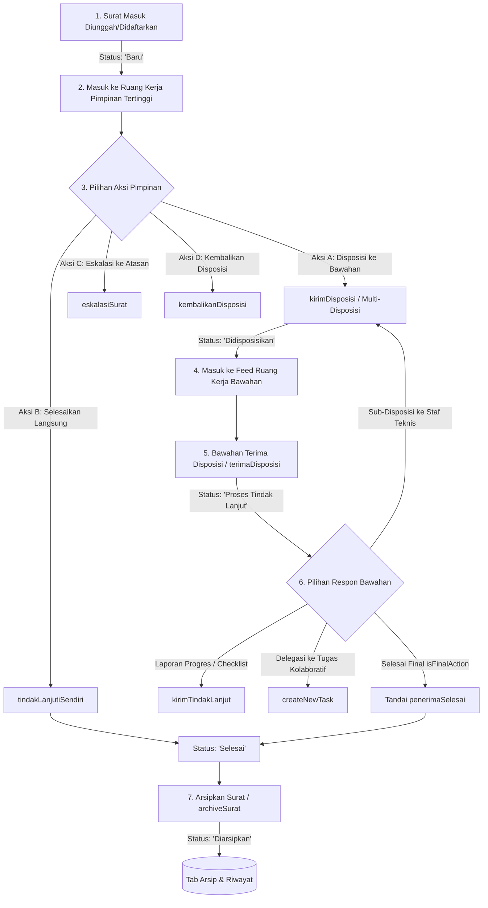

# Alur Kerja Disposisi Surat RUANG SIGAP & POROS

Panduan komprehensif ini mendokumentasikan siklus hidup (*lifecycle*), skema mutasi Firestore, verifikasi hirarki birokrasi, dan mekanisme optimasi UI/State untuk alur Disposisi Surat pada platform RUANG SIGAP dan POROS.

---

## 🔄 1. Diagram Siklus Hidup (End-to-End Lifecycle)



---

## 📋 2. Rincian Tahapan & Struktur Data

### Tahap 1: Registrasi Surat Masuk
- **Aktor**: Staf Tata Usaha (TU), Admin OPD, atau Agendais.
- **Koleksi**: `surat/{suratId}`
- **Initial State**:
  - `statusPenyelesaian`: `'Baru'`
  - `terlibatJabatanIds`: `[penerimaAwalJabatanId]`
  - `tanggalDiterima`: `serverTimestamp()`
  - `jenisSurat`: `'Biasa'` | `'Penting'` | `'Rahasia'` | `'Pemberitahuan'`

### Tahap 2: Routing ke Ruang Kerja Pimpinan
- **Hook SSOT**: [`useRuangKerjaFeed.ts`](file:///d:/DENY/project/ruang-sigap-v2/src/app/dashboard/sigap/hooks/useRuangKerjaFeed.ts)
- **Kriteria Pimpinan**: `effectiveJabatan.level <= 5` atau jabatan teratas dalam OPD (`topLeaderId`).
- **Pola 1-Read Super Efisien**:
  - `userSummaries/{effectiveJabatan.id}` menyediakan cache agregat disposisi aktif (`pendingDisposisi`).
  - Query tambahan hanya mengambil surat baru berstatus `'Baru'` di OPD tersebut yang belum pernah didisposisikan.

### Tahap 3: Filter Hirarki & Daftar Bawahan
- **Hook**: [`useBawahanList.ts`](file:///d:/DENY/project/ruang-sigap-v2/src/app/dashboard/sigap/hooks/useBawahanList.ts)
- **Aturan Birokrasi**:
  1. **Bawahan Langsung**: Pegawai dengan `idAtasan == effectiveJabatan.id` atau level jabatan di bawah pimpinan (`level > effectiveJabatan.level`).
  2. **Pimpinan Sub-OPD**: Jika pimpinan adalah Kepala Dinas (Level <= 5 & Eselon II), query memuat pimpinan UPTD/Sub-OPD (`idOpdInduk == opdIndukId`).
  3. **Pengurutan / Ranking**:
     - Eselon I (50), Eselon II (40), Eselon III (30), Eselon IV (20)
     - Pelaksana/Fungsional diurutkan berdasarkan Level Jabatan kemudian Abjad Nama.

---

## ⚡ 3. Aksi Pimpinan & Operasi Atomic Batch

### A. Multi-Disposisi (Top-Down)
- **Fungsi**: `kirimDisposisi(surat, targets, instruksi, batasWaktu, ...)`
- **Operasi Firestore**:
  - Buat dokumen baru `disposisi/{disposisiId}` dengan `kepadaJabatanId: string[]` dan `penerimaSnapshot`.
  - Update `surat/{suratId}`:
    - `statusPenyelesaian`: `'Didisposisikan'`
    - `terlibatJabatanIds`: `arrayUnion(effectiveJabatan.id, ...targetJabatanIds)`
    - `infoTampilan`: `{ senderName, recipientNames, isInformational }`
  - Buat notifikasi di `notifications` untuk setiap pegawai target.
  - Catat riwayat di `activityLogger`.
  - `optimisticRemoveDisposisi(...)` untuk membersihkan feed pimpinan tanpa lag.

### B. Tindak Lanjuti Sendiri (Mandiri)
- **Fungsi**: `tindakLanjutiSendiri(surat)`
- **Operasi Firestore**:
  - Buat dokumen `tindakLanjut` dengan `disposisiId: 'mandiri'`.
  - Update status `surat/{suratId}` langsung menjadi `'Selesai'`.
  - Menuliskan objek denormalisasi utuh:
    ```typescript
    infoTampilan: {
        senderName: actorName,
        recipientNames: userProfile.namaLengkap,
        isInformational: false
    }
    ```
  - Catat log aktivitas: *"Menyelesaikan Secara Mandiri (SELESAI)"*.

### C. Guard Deteksi Konflik Jadwal (Surat Undangan)
- **Modul Utilitas**: `src/lib/conflictUtils.ts` (`detectScheduleConflict`)
- **Aturan Ambang Batas**: Konflik terdeteksi jika selisih waktu antara agenda surat target dengan agenda yang sudah ada $\le 60\text{ menit}$ (1 jam).
- **Format Parsing Waktu Aman**: Gunakan regex `(\d{1,2})[:.](\d{2})` untuk mendukung berbagai format input waktu (e.g. `13:00`, `13.00`, `09:00 - 11:00`).
- **Urutan Deklarasi (Anti-TDZ)**: Selalu deklarasikan `useMemo` pembentuk `combinedPersonalAgenda` tepat setelah query data agenda sebelum dipanggil oleh handler aksi (`handleQuickSelfTindakLanjut`).
- **Respon Konflik di UI**:
  1. **Ruang Kerja**: Tampilkan modal interaktif `ScheduleConflictModal` dengan 2 opsi: *Disposisikan Ulang* atau *Tetap Lanjut Sendiri*.
  2. **Form Disposisi**: Tampilkan dialog konfirmasi dengan rincian agenda yang bertabrakan.

### D. Eskalasi Surat (Bottom-Up)
- **Fungsi**: `eskalasiSurat(surat, atasanTarget, catatan)`
- **Operasi Firestore**:
  - Buat record disposisi eskalasi ke atasan.
  - Tambahkan atasan ke `terlibatJabatanIds`.
  - Notifikasi ke atasan terkait.

### E. Kembalikan Disposisi
- **Fungsi**: `kembalikanDisposisi(disposisi, alasan)`
- **Operasi Firestore**:
  - Tandai `penerimaDikembalikan: arrayUnion(effectiveJabatan.id)`.
  - Jika seluruh penerima mengembalikan, ubah status surat menjadi `'Revisi Disposisi'`.
  - Kirim notifikasi pengembalian kembali ke pengirim asli.

---

## 🛠️ 4. Respon & Penyelesaian oleh Bawahan

1. **Terima Disposisi (`terimaDisposisi`)**:
   - `penerimaDiterima: arrayUnion(effectiveJabatan.id)`.
   - Update `surat.statusPenyelesaian` menjadi `'Proses Tindak Lanjut'`.
   - Kirim notifikasi konfirmasi penerimaan ke pimpinan.
   - Panggil `optimisticUpdateAcknowledge(...)`.

2. **Kirim Tindak Lanjut (`kirimTindakLanjut`)**:
   - Menulis ke `tindakLanjut/{tlId}`: `isiLaporan`, `judulLaporan`, `warnaLabel`, `checklist`, dan tautan lampiran Google Drive.
   - Jika `isFinalAction: true`:
     - Update `disposisi.penerimaSelesai: arrayUnion(effectiveJabatan.id)`.
     - Panggil `optimisticRemoveDisposisi(...)`.
     - Kirim notifikasi progres ke atasan.

3. **Penyelesaian Akhir & Pengarsipan (`archiveSurat`)**:
   - Ketika seluruh rantai disposisi selesai atau pimpinan menetapkan selesai:
     - `statusPenyelesaian: 'Selesai'`
     - `archiveSurat(...)` memindahkan status menjadi `'Diarsipkan'` dan mendistribusikan tembusan arsip jika diperlukan.

---

## 🌐 5. Penanganan Multi-Hierarchy & Dual Structure (ASN vs BLUD) — Non-Destruktif

Untuk unit kerja seperti **UPTD, BLUD (Solo Technopark / RSUD / Puskesmas)** yang memiliki 2 struktur paralel dalam 1 OPD (Struktur ASN & Struktur BLUD):

### A. Prinsip Non-Destruktif (100% Backward Compatible)
- **Field Opsional**: Field `klasterStruktur?: 'asn' | 'blud' | 'umum'` bersifat murni *additive* pada dokumen `Jabatan`.
- **Graceful Fallback**: Semua jabatan yang `klasterStruktur`-nya `undefined` / `null` otomatis diperlakukan sebagai `'umum'`, sehingga seluruh OPD standar (Dinas Kominfo, Bappeda, dll.) berjalan normal tanpa perubahan perilaku.

### B. Aturan Evaluasi di `useBawahanList`
1. **Jalur Eksplisit (`idAtasan` / Sub-tree Traversal)**: Pegawai yang memiliki rantai `idAtasan` menuju pimpinan (`isTransitiveBawahan`) **selalu diizinkan** sebagai prioritas tertinggi.
2. **Jalur Isolasi Klaster**:
   - Jika `effectiveJabatan.klasterStruktur` dan `userJabatan.klasterStruktur` keduanya terdefinisi dan berbeda (misal pimpinan `blud` vs target `asn`), **sembunyikan dari daftar disposisi**, kecuali jika pimpinan memiliki flag `allowCrossClusterDisposisi: true`.
3. **Pimpinan Lintas Klaster (`klasterStruktur: 'umum'`)**:
   - Staf TU / Agendais / Kepala Dinas bertipe `'umum'`, sehingga dapat memilih menyalurkan surat ke pucuk pimpinan ASN (Kepala UPTD) atau pucuk pimpinan BLUD (Pemimpin BLUD).

